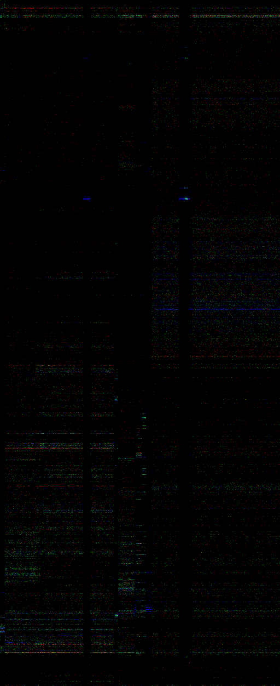

# Reordering results

This folder contains results for different reordering algorithm. All files have to named by the pattern:

```
<algorithm>_<runs>_<event>_<lower period>_<period's delta>.png
<runs>_<event>_<lower period>_<period's delta>.edges
```

Each plot reprsents distribution along the execution: <span style="background-color:#400">RED channel - iTLB-load-miss</span> <span style="background-color:#040">GREEN channel - icache-load-miss</span> <span style="background-color:#004">BLUE channel - cycles</span>. Normalization is logarithmic.

<table>
<tr>
<th>C3 reordering alogrithm</th><th>C3 reordering alogrithm</th>
</tr>
<tr>
<td></img></td><td></img></td>
</tr>
</table>

# C3 results
```bash
    (50 runs)
    30 491 182 994 ( +-  0,05% ) cycles:u                    
         2 993 731 ( +-  1,81% ) iTLB-load-misses            
       165 662 832 ( +- 0,12% )  cache-misses:u              
           7,86440 ( +- 0,05% )  time elapsed
```


# Vanilla
```bash
    (20 runs)
    30 814 918 062 ( +-  0,09% ) cycles:u                    
         3 844 318 ( +-  1,67% ) iTLB-load-misses            
       164 090 852 ( +- 0,22% )  cache-misses:u              
           7,95816 ( +- 0,09% )  time elapsed
```